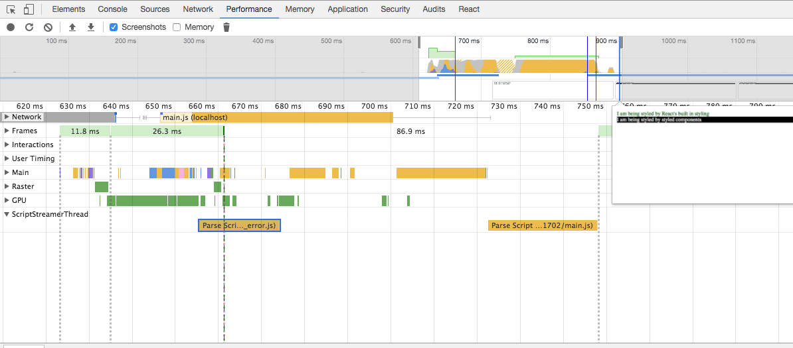
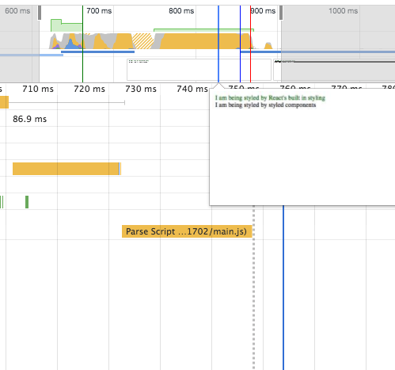

## TLTR

I've took ( https://github.com/jimthedev/next-styled-components-fouc ) and applied changes from official example of next-with-styled-components ( https://github.com/zeit/next.js/tree/master/examples/with-styled-components )


## Visual explanation

Here you can see the performance tab from Chrome dev tools after content loaded (please see the background of second line):



And here is small image how it looks during initial load:



## Getting started

```
clone this repository and cd into the directory
npm install
npm run dev
```

Hit refresh and notice the black background-color takes much longer to appear than the green color styles.
See a further description of the problem below.

Please see my package-lock.json for specific version used, including:

- next @ 4.2.3
- styled-components @ 2.4.0
- babel-plugin-styled-components @ 1.5.0

## The problem

When using styled-components with next.js you get a FOUC (flash of unstyled content).

If you use react's built in styles then you do not get this issue.

I am thinking that this is a problem with styled-components not being bundled into the server rendered example perhaps?

## Based on repo 

https://github.com/jimthedev/next-styled-components-fouc

## Investigation

1. `head` section of initial html of this example 

```
<head>
    <meta charSet="utf-8" class="next-head" />
    <link rel="preload" href="/_next/1517325460755/page/index.js" as="script" />
    <link rel="preload" href="/_next/1517325460755/page/_error.js" as="script" />
    <link rel="preload" href="/_next/1517325460755/manifest.js" as="script" />
    <link rel="preload" href="/_next/1517325460755/commons.js" as="script" />
    <link rel="preload" href="/_next/1517325460755/main.js" as="script" />
</head>
```

doesn't have any styles defined.

2. 